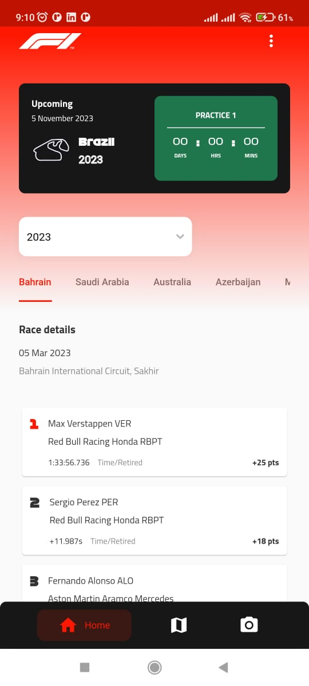
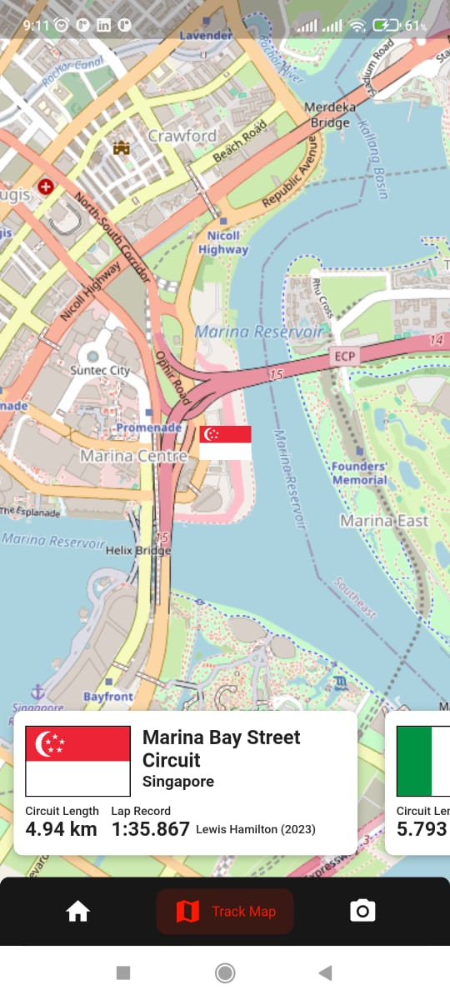

# F1 App

F1 App, a comprehensive application dedicated to Formula 1 enthusiasts. Explore the rich history of all Grand Prix races, track winners and positions, discover detailed circuit information and locations, and experience cutting-edge technology with a unique feature using TensorFlow for F1 car detection. Powered by a self-made API created through meticulous scraping of the official F1 website, the app delivers a seamless and immersive experience for avid fans of the racing world.

	 &nbsp; &nbsp; &nbsp;
	 &nbsp; &nbsp; &nbsp;
	

## Contributors

- Fahrendra Khoirul Ihtada ([@fahrendrakhoirul](https://github.com/FahrendraKhoirul))
- Rizha Alfianita ([@rizhaalfianita](https://github.com/rizhaalfianita))

## License

This project is licensed under the MIT License - see the [MIT LICENSE](https://choosealicense.com/licenses/mit/) file for details.
